# peak-CoT

> Stage 1 evidence that the reasoning horizon `k*` behaves more like a length-scaled internal position than a hard cutoff in Chain-of-Thought reasoning.

## Overview

This repository studies how Chain-of-Thought length, mechanistic reasoning horizon, and post-horizon behavior interact on a shared trace corpus.

The central question is simple: when a model produces longer reasoning traces, does reasoning eventually stop being useful, or does it remain active in a weaker and less efficient form?

Across the current Stage 1 results, the most stable answer is that `k*` is better understood as a **relative horizon** that scales with trace length `L`, not as the step where meaningful reasoning abruptly ends.

## Main Claims

- `k*` scales with trace length `L`, so it behaves more like a relative horizon than a fixed absolute step index.
- `k*` is not a reasoning cutoff; it is a transition point where marginal causal contribution begins to weaken.
- Most post-`k*` steps remain directionally positive, but their contribution becomes smaller and their geometric efficiency declines.
- Later reasoning is best described as continued convergence with systematic slowdown, not as sudden termination.
- TAS captures a broad geometric slowdown pattern, while NLDD captures more question-dependent local causal structure.

## Secondary Findings

- `k*/L` does not show a strong relationship with accuracy.
- Difficulty appears to shift the overall accuracy level more than it shifts the relative horizon structure.
- As traces get longer, diminishing returns after `k*` become stronger.

## What The Current Results Do Not Support

- They do not support a strong claim that `accuracy(L)` follows one clean, universal inverted-U pattern.
- They do not yet establish a direct paired explanation between behavioural optimal length `L*` and mechanistic horizon `k*`.
- They should not be presented as a direct reproduction of either the Optimal CoT Length paper or the NLDD paper.

## Scope And Interpretation Boundaries

- The current evidence comes from a single-model, single-dataset, Stage 1 setup.
- Trace length is induced through ICL prompting style rather than hard length control, so `L` partly mixes length with style and granularity.
- NLDD and TAS are measured only on correct traces.
- The main PQ analysis covers medium and hard questions and excludes degenerate cases.
- `difficulty_score` is an internal proxy from this run, not an external gold-standard difficulty label.
- A substantial fraction of `k*/L = 1` cases are likely short-trace resolution artefacts and should be interpreted cautiously.

## Core Figures

### T1-A. Global Overview

This figure combines three length-dependent signals in one view: accuracy, TAS, and `k*`.

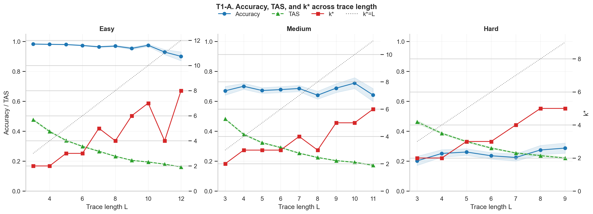

### Pooled `k*/L` vs `L`

This figure supports the relative-horizon interpretation: `k*` moves with `L`, while `k*/L` stays broadly stable without being a strict constant.

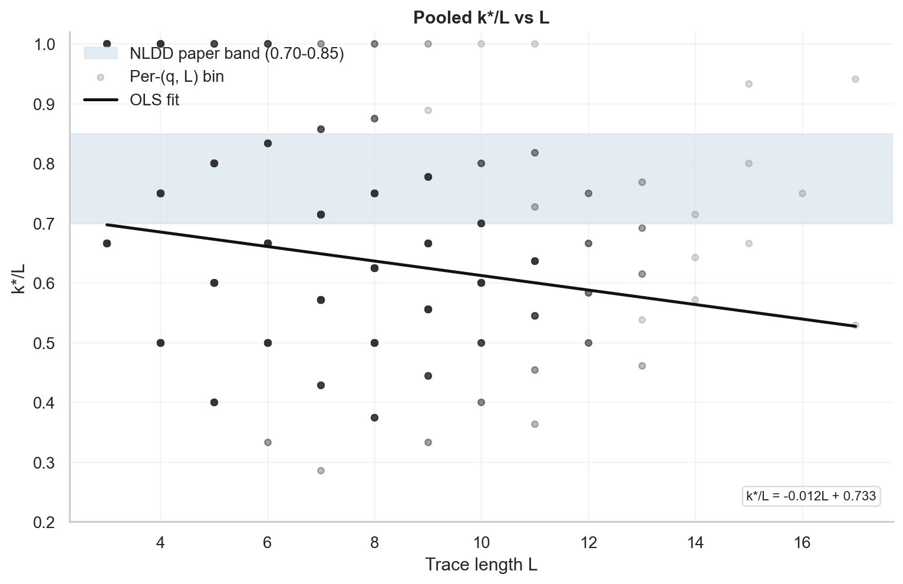

### T1-B Overall Heatmap

This figure is the main mechanism view. NLDD shows a structured mid-to-late diagonal band, while TAS shows a more regular geometric decay across steps.

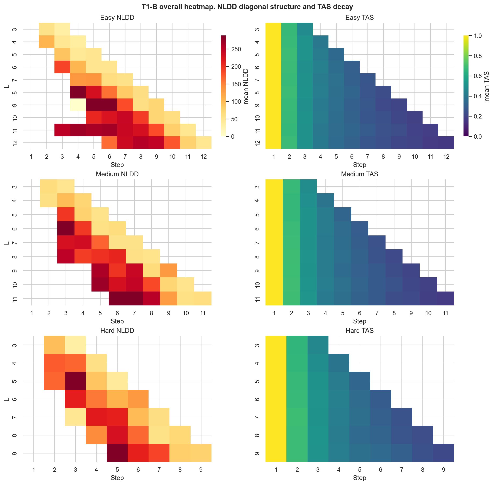

### Deep-Dive Figure G

This is the clearest compact summary of post-horizon behavior: after `k*`, the dominant regime is still “NLDD non-negative, TAS still moving.”

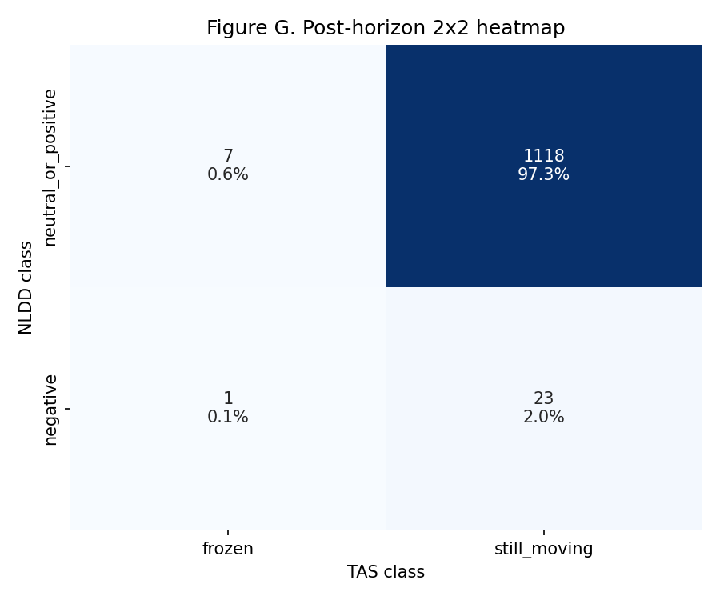

### Deep-Dive Figure J

This figure provides geometric support for the same interpretation: post-`k*` TAS slopes are systematically flatter than pre-`k*` slopes, indicating entry into a slower convergence phase.

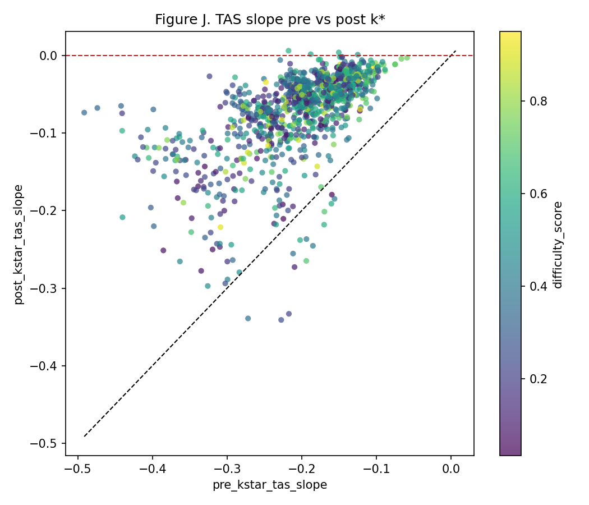

## Integrated Interpretation

Taken together, the current figure set supports the following picture:

1. `k*` marks a length-scaled internal position in the trace.
2. It marks an efficiency transition rather than the end of meaningful computation.
3. Later reasoning usually remains causally aligned with the final answer, but it becomes progressively lower-yield.
4. The strongest current story is therefore about horizon structure and post-horizon behavior, not about a fully resolved `L*`-to-`k*` alignment.

## Appendix Figures

The figures below remain useful as supporting material, but they are better treated as appendix evidence than as the main front-page narrative.

Show appendix figures

### Deep-Dive Figure E / F / H / I

  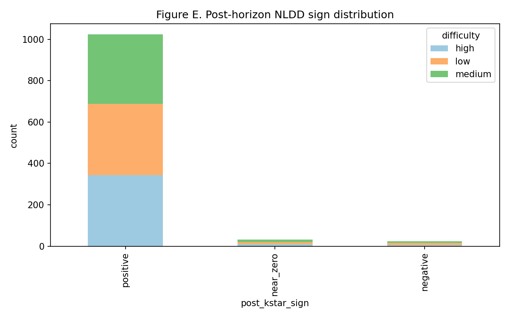
  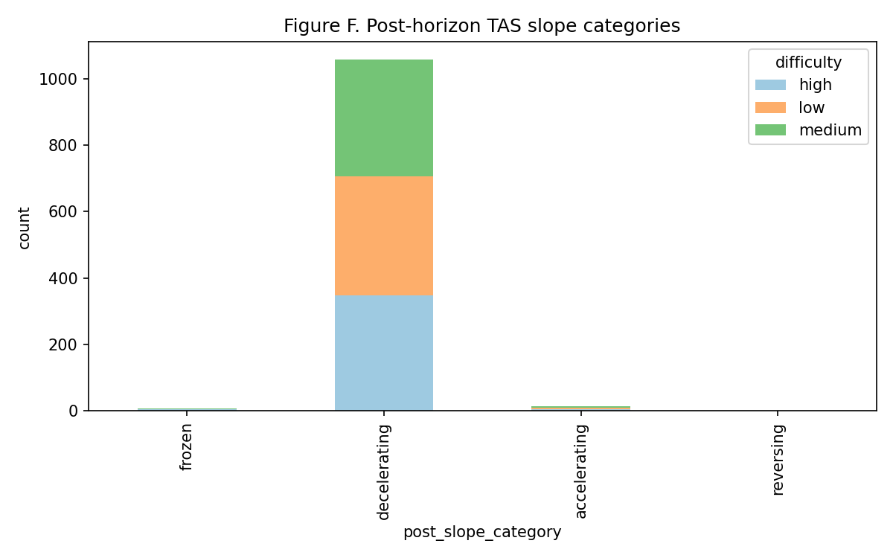

  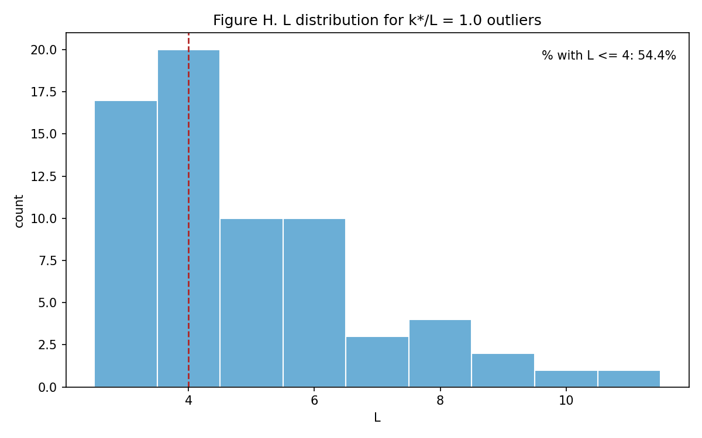
  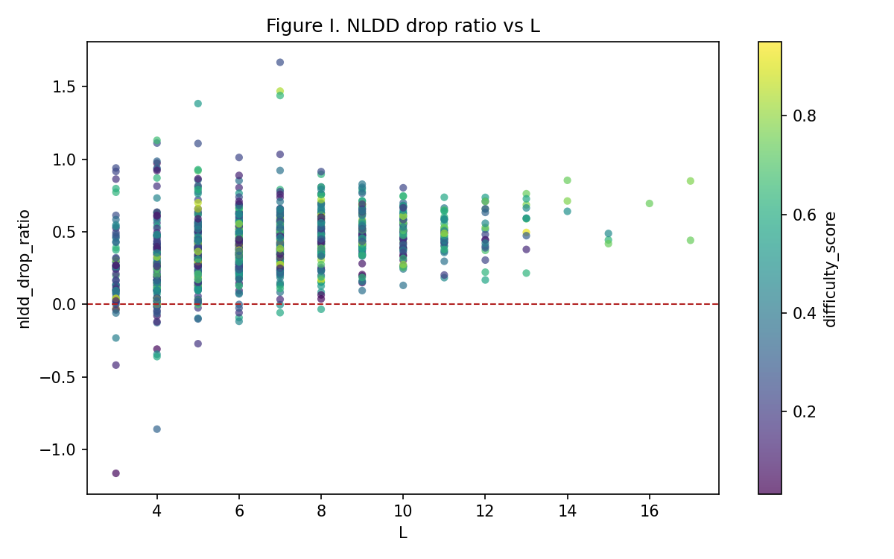

### T1-D Exemplar Heatmaps

These exemplar heatmaps illustrate local question-level structure and heterogeneity.

  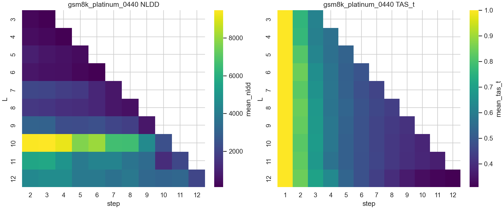
  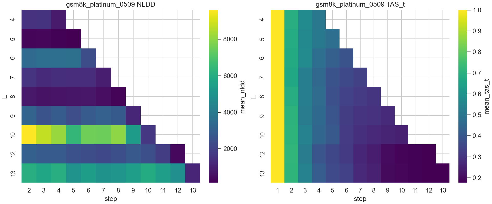
  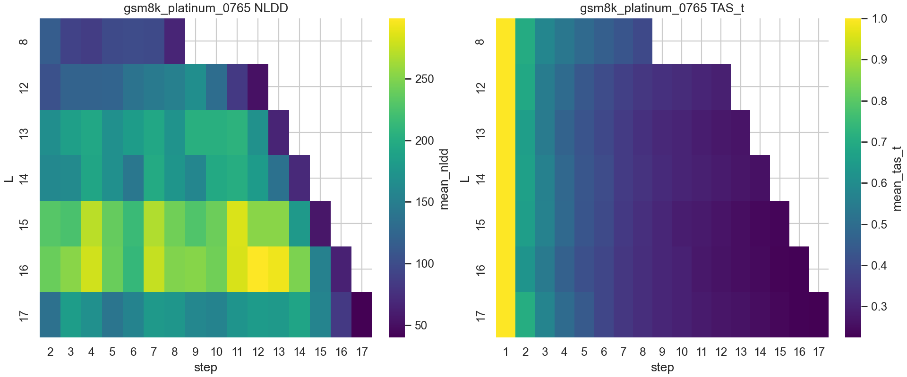

  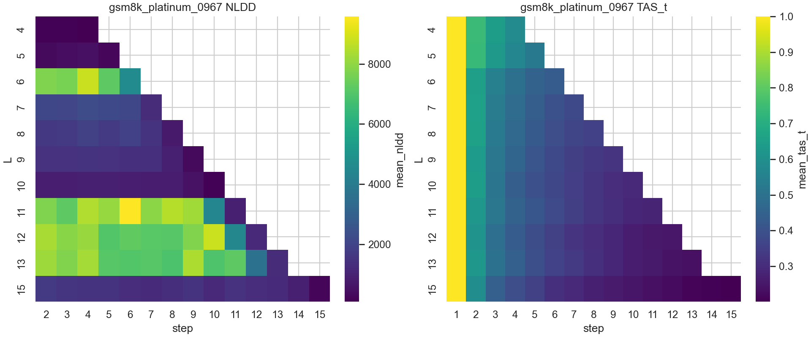
  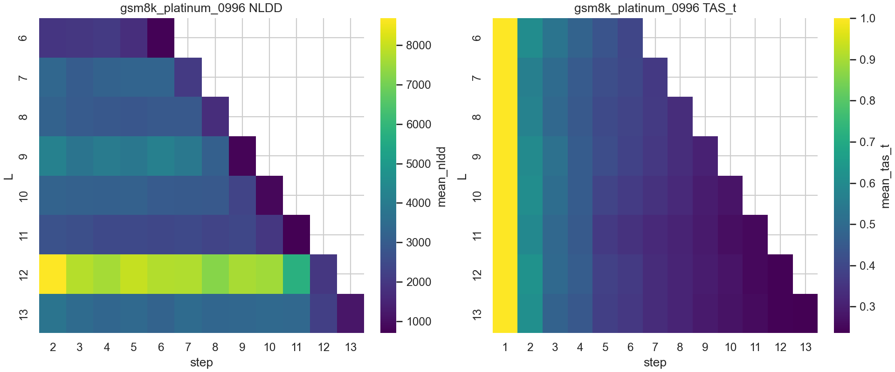

## Bottom Line

The current Stage 1 evidence does **not** support a simple story in which reasoning becomes meaningless after `k*`.

It supports a different story: reasoning usually continues after `k*`, but it does so in a slower, lower-efficiency, diminishing-return regime.
